<p align="center">
  
</p>

<p align="center">
  <a href="https://papermc.io"></a>
  <a href="https://github.com/DrakesCraft-Labs/MultiverseGambling/actions/workflows/compatibility.yml"></a>
  <a href="https://adoptium.net"></a>
  
  
  
</p>

<p align="center">
  <a href="README.md">English</a> · <b>Español</b> · <a href="wiki/Home-es.md">Wiki</a>
  <br/>
  <sub>Un proyecto de <b>Drakes Labs</b> · creado y mantenido por <b>Chagui68</b></sub>
</p>

---

**MultiverseGambling** es un motor de azar y apuestas para **Paper 1.21.11, 26.1 y 26.2** con
**22 minijuegos**: 12 en solitario contra la casa y 10 en grupo con rondas automáticas (todos
ellos jugables también **contra la casa** cuando no hay nadie más). Viven dentro de un
**mundo casino** propio donde las rondas se representan con display entities, y cada mensaje
se lee en **inglés o español**.

No es una colección de comandos suelta: es un motor donde cada moneda pasa por el mismo
sitio, cada tirada de dinero sale de un **azar verificable** y cada tabla de premios está
**fijada por tests**.

| | |
|---|---|
| 🎰 **22 juegos** | Ruleta, tragaperras, crash, minas, torres, blackjack, plinko, carreras, bote... |
| 🏛️ **Mundo casino** | Un mundo de 500 × 500 que se construye solo: plaza, bulevares y un pabellón por juego |
| ✨ **Espectáculos en vivo** | Ruletas que giran, bolas que caen, cohetes y cartas hechos con block e item displays |
| 🔘 **Botones holográficos** | Retirarse, pedir carta, plantarse o elegir lado con botones flotantes en la arena |
| 💎 **Apuestas con ítems** | Apuesta diamantes o cualquier ítem custom y gana copias de ese mismo ítem |
| 🔐 **Azar verificable** | Tiradas HMAC-SHA256 que cualquiera recalcula con `/mvgam verify` |
| 🌍 **Dos idiomas** | Cada jugador elige inglés o español para sí mismo |

```
mvn package      →  target/MultiverseGambling-1.0.4.jar
```

---

## Índice

- [Por qué este diseño](#por-qué-este-diseño)
- [Instalación](#instalación)
- [El mundo casino](#el-mundo-casino)
- [Apuestas con ítems](#apuestas-con-ítems)
- [La mesa de póker](#la-mesa-de-póker)
- [Idiomas](#idiomas)
- [El catálogo](#el-catálogo)
- [Retornos reales](#retornos-reales)
- [Azar verificable](#azar-verificable)
- [Comandos](#comandos)
- [Permisos](#permisos)
- [Configuración](#configuración)
- [Arquitectura](#arquitectura)
- [Añadir un juego nuevo](#añadir-un-juego-nuevo)
- [Qué cubren los tests](#qué-cubren-los-tests)

---

## Por qué este diseño

Un casino de servidor se rompe siempre de la misma forma: una tabla de premios que paga de
más, un pago que se aplica dos veces, o una tirada que un jugador puede predecir.
MultiverseGambling está construido para hacer esos tres fallos **imposibles por
construcción**, no por cuidado al escribir el código.

1. **La matemática del azar vive en `com.chagui68.multiversegambling.engine`, sin Bukkit.**
   Son clases de Java puro (ruleta, minas, crash, plinko, blackjack, póker de dados,
   tragaperras, rasca, rueda de premios, azar verificable). Se testean en milisegundos y el
   plugin solo puede *usar* esas fórmulas, nunca reinterpretarlas.

2. **Todo el dinero pasa por `EconomyManager` y `Wager`.** Una apuesta se retira del
   monedero al empezar y queda envuelta en un objeto que **solo se puede liquidar una vez**.
   Pagar dos veces la misma jugada deja de ser posible, no improbable.

3. **El azar que decide dinero es siempre `FairnessService`.** El `Rng` normal solo se usa
   para pintar animaciones. Cualquiera puede reproducir una tirada después.

Los tests ya han cazado bugs reales durante el desarrollo: el generador verificable devolvía
la mitad de las tiradas en negativo, el Plinko pagaba 9 veces de más por olvidar el divisor
de cubos, la ruleta calculaba mal su ventaja, cara o cruz no tenía ventaja ninguna y la
ruleta "clásica" ofrecía apostar al verde a 2x cuando eso es un timo. Todos están cubiertos
por un test que impide que vuelvan.

---

## Instalación

**Requisitos:** Paper 1.21.11, 26.1 o 26.2 (un mismo jar para las tres), Java 21 (los
servidores 26.x usan Java 25). Vault es opcional pero recomendado.

El plugin se compila contra `paper-api:1.21.11-R0.1-SNAPSHOT` y declara `api-version:
'1.21'`, así que también carga en cualquier servidor de la serie 1.21.x y en 26.1 y 26.2. Las
mismas fuentes se compilan y prueban contra esas APIs con `mvn -P api-26.1 test` y
`mvn -P api-26.2 test` (JDK 25). En cada push, el workflow
[Version compatibility](.github/workflows/compatibility.yml) compila el jar una vez y arranca
un servidor Paper 1.21.11, 26.1 y 26.2 real con ese mismo jar; falla ante cualquier error de
carga, de habilitación o de enlace. No depende de NMS
ni de ningún módulo interno: solo API pública.

```bash
mvn package
cp target/MultiverseGambling-1.0.4.jar ~/servidor/plugins/
```

Sin Vault el plugin arranca su propio monedero en
`plugins/MultiverseGambling/balances.json`, con saldo de bienvenida configurable. Con Vault
usa la economía del servidor y no duplica nada. Se controla con
`economy.provider: auto | sbank | vault | internal`.

El puente es deliberadamente agnóstico. Además de la economía Vault de siempre, el casino
habla con las **cuentas bancarias de sBank**: en un servidor que guarda el dinero de los
jugadores en el banco, las apuestas y los premios mueven ese saldo, con el mismo redondeo a
dos decimales y el mismo registro de auditoría que escribe el propio banco. `auto` prueba los
motores en el orden de `economy.auto-order` (banco, luego Vault, luego el monedero interno) y
siempre termina en un monedero, así que el plugin nunca puede fallar al arrancar por culpa
del dinero.

Archivos de datos que crea:

| Archivo | Contenido |
|---|---|
| `balances.json` | Monedero interno (solo sin Vault) |
| `stats.json` | Estadísticas y rankings por jugador |
| `fairness.json` | Semillas de cliente y secreto del servidor para la auditoría |
| `languages.json` | El idioma que eligió cada jugador |
| `pending-items.yml` | Premios en ítems de jugadores que salieron a mitad de ronda |
| `poker-table.yml` | Quién está sentado en la mesa de póker, para devolverlo todo tras un fallo |
| `item-values.yml` | Valor de referencia de cada ítem que puede comprar fichas de póker |

---

## El mundo casino

El plugin puede crear y mantener un **mundo aparte** que contiene todas las estructuras, así
no hay que pegar nada a mano y el mundo de juego queda limpio.

```
/mvgam world          → te lleva al casino
/mvgam world build    → reconstruye la plaza, los bulevares y todos los pabellones (admin)
/mvgam world info     → informa de qué le falta al mundo casino (admin)
```

Por defecto crea un **mundo plano de 500 × 500 bloques** llamado `mvgam_casino` con borde
centrado, siempre a mediodía, sin criaturas y con bloques que solo los administradores pueden
cambiar, y levanta:

- una **plaza de mármol** (radio 36) con una fuente iluminada, anillos de oro, farolas grandes
  y jardineras, una moneda de oro gigante girando sobre la fuente y un cartel de bienvenida en
  el spawn;
- **un pabellón amurallado por juego** (41 × 41 bloques) en una rejilla cuadrada que se llena de
  dentro hacia fuera: un escenario oscuro con un anillo de oro, suelo de mármol, muros con
  vidrieras del color del juego, una puerta de cuarzo en cada lado, torres en las esquinas,
  gradas y luces invisibles, con el nombre del juego flotando encima y su icono girando debajo;
- **bulevares de siete bloques** por cada fila y columna de la rejilla y una ronda que rodea el
  casino, con farolas y avenidas de árboles; las casillas sin juego se convierten en jardines.

Los 22 juegos ocupan 408 × 408 bloques, así que el mundo por defecto deja un cinturón verde
alrededor. La construcción va **en segundo plano, unos pocos chunks por tick**, y el casino se
reconstruye solo cuando cambia su diseño (una actualización, un juego nuevo, un tablero más
grande).

Todo se controla desde `world:` en [config.yml](src/main/resources/config.yml):

```yaml
world:
  enabled: true            # crear/cargar el mundo al arrancar
  name: 'mvgam_casino'
  size: 500                # lado del cuadrado, en bloques (200-2000)
  build-structures: true   # plaza, pabellones y bulevares, reconstruidos si cambian
  teleport-on-join: false  # mandar aquí a cada jugador al entrar
  always-day: true         # siempre mediodía; false usa "time"
  time: 13000              # hora fija si always-day está apagado; -1 mantiene el ciclo
```

### Animaciones en el mundo

Los resultados no son solo texto. Cuando el mundo casino está listo, cada juego **escenifica
la ronda en su pabellón con display entities**, con movimiento interpolado y totalmente
iluminadas:

| Juego | Lo que se escenifica en el pabellón |
|---|---|
| **Ruleta** | Una ruleta inclinada con sus números, bombillas en el aro y una bola que cae en espiral en la casilla ganadora |
| **Ruleta de la suerte** | Una rueda de la fortuna de pie con sus multiplicadores, que se para bajo un puntero dorado |
| **Ruleta de colores** (grupo) | La rueda real de 18 rojas, 18 negras y una verde, con su bola |
| **Bote** y **Rifa** (grupo) | Una rueda de la fortuna con una porción con nombre por jugador, del tamaño de su apuesta o de sus boletos |
| **Tragaperras** | Una máquina iluminada: se tira de la palanca y tres tambores giran y se paran en la línea de pago |
| **Plinko** | Una pared de clavijas con los multiplicadores bajo los cubos y una bola que salta siguiendo los rebotes reales |
| **Crash** | Un cohete que sube por la curva del multiplicador en una gráfica, y sale volando en dorado o estalla |
| **Dados** | Un marcador con la zona ganadora, un dado que rueda y un contador que gira hasta la tirada |
| **Póker de dados** (grupo) | Cinco dados lanzados sobre una mesa de fieltro que se asientan uno a uno |
| **Carrera** (grupo) | Caballos de verdad con armadura teñida galopando en una pista escalonada |
| **Ruleta rusa** (grupo) | Un revólver gigante cuyo tambor gira y se para bajo el percutor antes de disparar o hacer clic |
| **Bomba caliente** (grupo) | Una TNT que late con la mecha ardiendo y una TNT pequeña sobre la cabeza de quien la tiene |
| **Cara o cruz** y **Duelo** | Una moneda lanzada desde un pedestal que cae de canto; el duelo cuelga a los lados las cabezas de ambos jugadores |
| **Blackjack** y **Alto-bajo** | Una mesa de cartas donde las cartas vuelan desde el sabot y se voltean |

Todas son **solo pintura**: el resultado lo sortea el generador provablemente justo antes
de que empiece la animación, así que lo que se ve en el pabellón y lo que paga la cartera
siempre coinciden.

### Jugar sobre los bloques

Cuatro juegos no muestran un resultado sino una **secuencia de elecciones**, así que se
juegan en los bloques de su escenario: pulsa el escenario de su pabellón para abrir el juego
y, a partir de ahí, las casillas son la entrada.

| Juego | Tablero | Cómo se juega |
|---|---|---|
| **Minas** | Una rejilla de 5x5, un cajero y dos bloques para elegir cuántas minas hay | Pulsa casillas para destaparlas; el bloque dorado cobra |
| **Torres** | Una fila de casillas por piso, con los pisos ya subidos en verde | Pulsa una casilla del piso encendido; el bloque dorado cobra |
| **Rasca y Gana** | Una tarjeta de 3x3 | Tres clics rascan tres casillas |
| **Tablero de Bombas** (grupo) | El tablero compartido de 9x4 | El turno pasa de jugador en jugador y al que le toca se coloca sobre el tablero |

Los tableros forman parte de la construcción del mundo. Cada ronda devuelve sus casillas a
como estaban, y los mismos interruptores de `world.animations` los gobiernan: con
`enabled: false` los cuatro juegos vuelven a sus menús.

El decorado de las animaciones es temporal: aparece al empezar la ronda, se queda un momento
tras el resultado para que dé tiempo a verlo y luego se retira, así que el pabellón siempre
vuelve a su escenario limpio aunque el jugador se desconecte o el servidor se pare a mitad de
giro. Los menús siguen ahí para lo que no es un resultado ni una elección (apostar, elegir
casilla) y quien juegue con el mundo desactivado conserva la barra de acción de siempre.

```yaml
world:
  animations:
    enabled: true           # escenificar las rondas en los pabellones
    teleport-players: true  # llevar al jugador a su pabellón para verlo
    view-distance: 14       # bloques entre el centro del escenario y el espectador
```

Cosas que conviene saber:

- La **geometría son clases puras** (`CasinoLayout`, `StageFrame`, `CrashCurve`, `WheelMath`)
  sin Bukkit, así que está testeada: la suite comprueba que los 22 juegos caben en 500
  bloques, que ningún pabellón se solapa, que nada tapa el spawn, que cada pabellón está en la
  red de bulevares y que los espectáculos miran a la puerta principal sin quedar en espejo. Los
  tableros usan la misma idea: `BoardGrid` traduce un clic en un bloque a la casilla de una
  ronda.
- Si `world.size` es pequeño para la rejilla, el plugin **agranda el mundo** en pasos de 50
  bloques (hasta 2000) en vez de fallar.
- Apunta `world.name` a un mundo existente para reutilizarlo (se limpia su superficie), o pon
  `enabled: false` y construye el casino a mano: `/mvgam world` te dirá entonces que el mundo
  está desactivado.
- El plugin se niega a construir las estructuras en el mundo principal del servidor, así que
  nunca pisa el spawn de un mapa de supervivencia.
- Los nombres flotantes usan el catálogo del idioma por defecto, así que un servidor en
  español tiene los pabellones rotulados en español.

La referencia completa está en la página [Mundo](wiki/Mundo-Casino-es.md) de la wiki.

---

## Apuestas con ítems

El dinero no es lo único que se apuesta. Seis juegos en solitario aceptan **ítems** como
apuesta: **Ruleta clásica, Tragaperras, Dados, Plinko, Ruleta de la suerte y Cara o cruz**.
Elige **❖ Apostar items** en el menú de apuesta y se abre un cofre especial:

1. Coloca los ítems que quieres apostar en el centro del cofre: **un solo tipo de ítem, la
   cantidad que quieras** (hasta `item-bets.max-items`, 1.728 por defecto).
2. El panel de la derecha muestra **cada resultado posible y cuántos de ese ítem recibes**
   en cada uno, por ejemplo, apostando 100 diamantes a Cara o cruz: *Acertar la cara » 1.96x = 196 × Diamante*.
3. Pulsa **Jugar con estos ítems**. Cerrar o cancelar te devuelve todo.

Los ítems vanilla y los **ítems custom** funcionan igual: el premio son copias del ítem
apostado, así que conserva su nombre, lore, encantamientos, custom model data o etiquetas
de otros plugins. Un ID custom de otro plugin sigue siendo ese ítem.

| Regla | Por qué |
|---|---|
| La fracción de un ítem se paga **por probabilidad** (19,6 ítems → 19, más un 60% de recibir el 20.º) | El pago medio es exactamente el pago en dinero: no hay recorte oculto por redondeo |
| Las shulker boxes y los bundles están bloqueados por defecto | Nadie multiplica el contenido de una caja; añade más en `item-bets.blocked` |
| Lo que no cabe en el inventario cae a tus pies | Nada se pierde con el inventario lleno |
| Si te desconectas a mitad de ronda recibes los ítems al volver | Se guardan en `pending-items.yml` |
| Las rondas con ítems no cuentan en las estadísticas ni en los rankings de dinero | La clasificación solo compara monedas |

```yaml
item-bets:
  enabled: true
  max-items: 1728        # máximo de ítems por apuesta
  blocked:               # nombre exacto, *SUFIJO o PREFIJO*
    - '*SHULKER_BOX'
    - '*BUNDLE'
```

---

## La mesa de póker

**Texas hold'em para hasta 8 jugadores** (`/mvgam play poker`), en una gran mesa ovalada
tumbada en el centro de su pabellón, con un crupier de pie tras el sabot.

- **Sentarse**: acércate a una silla libre y pulsa su holograma **✚ SENTARSE**, elige tu
  entrada (en ciegas grandes) y quedas sentado en la silla. Agáchate o pulsa **⏏ Levantarse**
  para irte.
- **Cartas privadas**: tus dos cartas están boca abajo para toda la sala; solo tú las ves
  boca arriba, además de una copia más grande flotando frente a ti. Nadie puede leer tu mano
  dando vueltas a la mesa.
- **Tus propios botones**: en tu turno aparecen botones flotantes frente a tu silla, solo
  para ti: **Retirarse**, **Pasar / Igualar**, **All in**, y **◀ Subir a ▶** para elegir la
  subida (mínimo, un tercio del bote, la mitad, tres cuartos, el bote...). Las mismas jugadas
  llegan como botones del chat. Tienes `action-seconds` (30) para actuar; después la mesa pasa
  o se retira por ti.
- **El crupier** baraja con el generador verificable, reparte las cartas volando desde el
  sabot, quema antes de cada calle, mueve el botón de dealer y empuja el bote al ganador.
- **Reglas reales**: ciegas, mano a mano con el botón en la ciega pequeña, subidas mínimas,
  all-in que no reabren las apuestas, apuestas no igualadas devueltas, **botes secundarios**,
  botes repartidos con la ficha impar a la izquierda del botón.
- **Contra la casa**: solo en la mesa, pulsa **⚑ Jugar contra la casa** y la casa se sienta
  con tantas fichas como tú. Juega estimando sus probabilidades frente al bote y se queda
  `house-rake` (5%) de cada bote tras el flop mientras juega.

### Fichas por ítems

El póker se juega con dinero, pero puedes **comprar fichas con ítems**: vanilla, de
**Slimefun** y de **MultiverseCreatures** y de **todos los addons de Slimefun**, mezclados en un mismo cofre. Cada uno vale lo que
dice [item-values.yml](src/main/resources/item-values.yml), y al levantarte recuperas primero
tus ítems (los más valiosos primero, mientras tus fichas los cubran) y el resto en dinero.
Cómo se fijaron los valores:

| Origen | Cómo se valora |
|---|---|
| Vanilla | Frente al ancla **1 diamante = 100 monedas**: lo difícil que es conseguirlo |
| Slimefun (514 ítems) | Generado desde las recetas de Slimefun: sus ingredientes, por lo que añade la máquina o el ritual (mesa de crafteo mejorada ×1.05, fundición ×1.08, mesa mágica ×1.15, cámara de presión caliente ×1.15, altar antiguo ×1.40), más 0,5 monedas por nivel de investigación, dividido entre lo que produce la receta. Los recursos del mundo (mineral tamizado, uranio, petróleo) tienen valor fijo |
| MultiverseCreatures (59 ítems) | Un drop vale lo difícil que es su criatura dividido entre su probabilidad (Orbe del Caos: 150 / 60% = 250); los crafteados valen sus ingredientes ×1.10, las armas, armaduras y reliquias legendarias ×1.65; los del mercader valen su intercambio (Excalibur: 16 Núcleos Estelares + 32 netherite) |
| Addons de Slimefun (todos los instalados) | Se valoran en cada arranque desde las recetas que Slimefun registró de verdad, con la misma regla: DynaTech, Supreme, Galactifun, ExoticGarden, Networks, LiteXpansion, FluffyMachines y cualquier otro addon. Los ítems que se encuentran (drops, recursos GEO) y los que no tienen receta parten de 25 monedas. El resultado se escribe en `plugins/MultiverseGambling/item-values-addons.yml`, agrupado por addon; copia una línea bajo `addons:` en item-values.yml para cambiarla |

Un ítem se reconoce por el ID que su plugin guarda en él, nunca por su nombre, así que un
ítem renombrado no pasa por uno custom; un ítem vanilla o de MultiverseCreatures que no está en el archivo se rechaza.
Edita cualquier valor, o `scale` para cambiarlos todos, y `/mvgam reload`.

---

## Idiomas

El plugin **se traduce a sí mismo dentro del juego**. Cada jugador elige lo que lee, y los
comandos de administración contestan en el idioma de quien los ejecutó.

```
/mvgam language es      → este jugador pasa a leer español
/mvgam language en      → vuelve al inglés
/mvgam language         → muestra el idioma actual y los disponibles
/mvgam language reset   → seguir otra vez el idioma del cliente de Minecraft
```

Cómo funciona:

- Cada idioma es un archivo en `plugins/MultiverseGambling/lang/`, un código por archivo:
  `en.yml`, `es.yml`. Los dos se escriben en el primer arranque, y un `messages.yml` de una
  versión anterior se migra solo a `lang/en.yml`.
- La elección se guarda **por jugador** en `languages.json`, así que sobrevive a los
  reinicios, y el orden de búsqueda es: idioma elegido → idioma del cliente de Minecraft
  (si `language.follow-client` es `true`) → `language.default` → inglés.
- La consola y los carteles del mundo usan `language.default`.
- Añadir un idioma es copiar un archivo: copia `lang/en.yml` a `lang/<codigo>.yml`,
  tradúcelo, y el código aparece al instante en `/mvgam language`. Los códigos que no
  existen se rechazan mostrando la lista de disponibles.
- Se acepta entrada libre: `es`, `ES`, `es_es`, `es-AR`, `spanish` y `español` significan
  todos español.
- Una clave que falte se dibuja como `&c[missing message: <clave>]` en vez de romper, así que
  una traducción parcial degrada con elegancia.
- Los **nombres y descripciones** de los juegos están en inglés en el código y se pueden
  sobrescribir por idioma con un bloque `catalog.<id-juego>.name` /
  `catalog.<id-juego>.description`; `lang/es.yml` incluye todo el catálogo español como
  ejemplo.
- Los **paneles de cada juego** — títulos de ventana, botones, descripciones de objetos y
  las líneas que esos menús escriben en el chat — viven en `panel.*`, una sección por juego,
  así que el interior de un minijuego también se lee en el idioma del jugador. Un test hace
  fallar la compilación si `lang/en.yml` y `lang/es.yml` se desvían en claves o placeholders.

```yaml
language:
  default: en          # consola, jugadores sin preferencia, carteles del mundo
  follow-client: true  # quien nunca eligió sigue el idioma de su cliente
```

Los detalles, incluido cómo añadir un tercer idioma, están en la página
[Idiomas](wiki/Idiomas-es.md) de la wiki.

---

## El catálogo

### En solitario (12)

| Juego | Id | Reglas | Paga |
|---|---|---|---|
| **Ruleta Clásica** | `roulette` | Rojo, negro, par/impar, 1-18/19-36, docenas, columnas o número exacto. El 0 es verde y **solo** paga a la apuesta directa, como en la ruleta real. | 2x / 3x / 36x |
| **Tragamonedas** | `slots` | 3 rodillos, 7 símbolos ponderados. Tres iguales pagan la tabla; las cerezas pagan algo con dos. | hasta 600x |
| **Crash** | `crash` | La curva sube sola y hay que retirarse antes de que estalle. El punto de explosión sale de una sola tirada verificable. | 1.00x en adelante |
| **Minas** | `mines` | Rejilla de 25 casillas con 1 a 24 minas. Cada acierto sube el multiplicador; te retiras cuando quieras. | crece con la dificultad |
| **La Torre** | `towers` | 9 pisos y cinco dificultades, de fácil (4 puertas, 1 bomba) a maestro (4 puertas, 3 bombas). Elige una puerta segura para subir, retírate antes de caer. | crece por piso |
| **Blackjack** | `blackjack` | Baraja de 6 mazos. Tras la primera carta **continúas** o **abandonas recuperando la mitad**. Natural 3:2, empate devuelve apuesta, se puede doblar. | hasta 2.5x |
| **Mayor o Menor** | `high-low` | Dos botones flotantes, mayor o menor, cada uno con lo que paga. Encadena aciertos; cada paso se paga según los rangos que quedan de verdad. | encadenable |
| **Dados** | `dice` | Objetivo del 0.01 al 99.99 con apuesta por encima o por debajo. Pago justo recortado. | hasta ~99x |
| **Plinko** | `plinko` | La bolita cae por la pirámide. Los cubos salen de la distribución binomial real, no de una tabla inventada. | hasta cientos de x |
| **Rasca y Gana** | `scratch` | Destapa 3 de 9 casillas. Tres iguales pagan el premio del símbolo, dos devuelven parte. | hasta 50x |
| **Ruleta de la Suerte** | `lucky-wheel` | 12 casillas igual de probables, la mayoría sin premio y un par de golpes grandes. | hasta 4x |
| **Cara o Cruz** | `coin-flip` | Elige cara o cruz. Pago justo recortado (no 2x fijo: eso no daría ventaja a la casa). | ~1.96x |

### En grupo (10)

Todos funcionan por rondas automáticas: entra quien quiere, apuesta durante la ventana, la
ronda se juega sola y la siguiente arranca sin que nadie lance comandos. Si estás solo,
el menú de apuesta ofrece **jugar contra la casa**: el casino ocupa el otro asiento con la
misma ventaja de la casa que los juegos en solitario, así que una mesa nunca se queda vacía.

| Juego | Id | Reglas | Jugadores |
|---|---|---|---|
| **Ruleta de Colores** | `color-roulette` | Cada uno apuesta a rojo, negro o verde. El verde es una casilla única, así que paga ~36x con la misma ventaja que el rojo. | 2-24 |
| **Bote Común** | `jackpot` | Todos ponen dinero y las papeletas son proporcionales a lo apostado. Un ganador se lo lleva todo. | 2-24 |
| **Bomba Caliente** | `hot-bomb` | La TNT pasa de mano en mano con una mecha sorteada. Al que le pille, fuera y su dinero al bote. | 2-12 |
| **Tablero de Bombas** | `bomb-board` | Tablero compartido con bombas escondidas; por turnos cada uno destapa. El último en pie cobra. | 2-12 |
| **Ruleta Rusa** | `russian-roulette` | Por turnos, cada uno aprieta el gatillo con 1 bala en 6 recámaras. El superviviente se lleva el bote. | 2-8 |
| **Carrera de Caballos** | `race` | 8 caballos con probabilidades publicadas. Elegir el favorito paga poco; el tapado, mucho. | 2-24 |
| **Duelo 1v1** | `duel` | Retas a alguien por una cantidad; los dos ponen lo mismo y una moneda decide. Si no acepta a tiempo, recuperas tu dinero. | 2 |
| **Rifa** | `raffle` | Boletas a precio fijo y sorteo de **tres premios**: 70%, 20% y 10% del bote. | 2-24 |
| **Póker de Dados** | `dice-poker` | Cinco dados cada uno; gana la mejor mano. Los empates reparten el bote. | 2-16 |
| **Póker** | `poker` | Texas hold'em en una mesa real: cartas privadas, tus propios botones holográficos, botes secundarios, all in. Las fichas se pueden comprar con ítems. | 2-8 |

Los ids son estables y `/mvgam play` exige exactamente ese id, nunca un nombre ni una
coincidencia parcial: `/mvgam play lucky-wheel` funciona, `/mvgam play lucky` no. El
autocompletado lista los ids.

---

## Retornos reales

Estos números no están estimados: salen de las fórmulas y los fija la suite de tests.
`mvn test` los vuelve a comprobar en cada compilación.

| Juego | Retorno | Nota |
|---|---|---|
| Ruleta Clásica (europea) | **97.30%** | Todas las apuestas comparten retorno: 36/37 |
| Ruleta Clásica (americana) | **94.74%** | El 00 duplica la ventaja |
| Ruleta de Colores | **97.30%** | Igual en rojo, negro y verde |
| Tragamonedas | **94.75%** | Tabla calibrada a mano y verificada |
| Crash | **98.00%** | El mismo valor esperado en cualquier objetivo |
| Minas / La Torre | **98.00%** | El multiplicador es la inversa exacta de la probabilidad |
| Mayor o Menor | **~98.15%** | Por paso, contando los empates |
| Dados / Plinko | **98.00%** | Plinko baja algo más por el tope de 500x |
| Cara o Cruz | **98.00%** | Pago justo recortado |
| Rasca y Gana | **92.15%** | La tarjeta más generosa en premios pequeños |
| Ruleta de la Suerte | **95.00%** | Es la media de sus 12 casillas |
| Carrera de Caballos | **98.00%** | Cada caballo por separado |
| Bote, Rifa, Póker, Duelo, Bombas, Bomba Caliente, Ruleta Rusa | **100% − comisión** | Jugador contra jugador: por defecto sin comisión |

Todos los juegos contra la casa usan `game.house-edge` (2% por defecto) salvo aquellos cuya
ventaja está fijada por la propia rueda, como la ruleta.

---

## Azar verificable

Al arrancar, el plugin genera un secreto y **publica su hash**:

```
/mvgam verify
```

Cada tirada se deriva de `HMAC-SHA256(secreto, semillaDelJugador:nonce:cursor)`. Cuando el
secreto rota, se revela el anterior y cualquiera puede recalcular las tiradas para comprobar
que la casa no las retocó. La semilla de cliente es tuya y se puede cambiar con
`/mvgam verify <texto>`; mezclarla con el secreto del servidor es lo que impide que el
servidor pueda elegir el resultado después de conocerte.

Las tiradas de las partidas en grupo se atribuyen a la identidad fija del casino (UUID
cero), así que una ronda de bomba caliente o una carrera se puede auditar entera, paso a
paso.

---

## Comandos

| Comando | Qué hace |
|---|---|
| `/mvgam` | Abre el menú principal con las dos pestañas |
| `/mvgam games [solo\|group]` | Lista el catálogo con sus límites de apuesta |
| `/mvgam play <id>` | Juega a un juego por su id exacto |
| `/mvgam action <accion>` | Punto de entrada de los **botones del chat** (shoot, horse 3, accept...) |
| `/mvgam balance [jugador]` | Consulta el saldo |
| `/mvgam stats [jugador]` | Estadísticas: partidas, retorno real, juego favorito |
| `/mvgam top [profit\|wagered\|prize]` | Ranking del servidor |
| `/mvgam verify [semilla]` | Auditoría del azar y cambio de semilla |
| `/mvgam world [build\|info]` | Te lleva al mundo casino, lo reconstruye, o informa de qué le falta |
| `/mvgam language [codigo\|reset]` | Cambia el idioma que lee este jugador |
| `/mvgam info` | Economía activa, juegos y secreto actual |
| `/mvgam give \| take \| set` | Administración de saldo |
| `/mvgam cancel <jugador>` | Cierra la partida de alguien y devuelve su dinero |
| `/mvgam reload` | Recarga config y mensajes sin tocar las partidas en curso |

El comando es `/mvgam` y **no tiene alias**: cada subcomando tiene una sola forma, así que el
autocompletado y los mensajes nunca pueden discrepar.

Los permisos, las etiquetas y el mundo que crea llevan el prefijo `mvgam_`, así que un
servidor con otros plugins nunca mezcla un identificador: `mvgam_play`, `mvgam_top`,
`mvgam_admin` y el mundo `mvgam_casino`.

## Permisos

| Permiso | Por defecto | Permite |
|---|---|---|
| `mvgam_play` | todos | Entrar al casino, jugar a los juegos públicos y elegir idioma |
| `mvgam_top` | todos | Ver el ranking del servidor |
| `mvgam_admin` | operadores | Recargar, construir el mundo casino, dar/quitar saldo y cancelar partidas |

---

## Configuración

Todo está en `plugins/MultiverseGambling/config.yml`, en inglés y comentado: economía
(`provider`, `currency`, `format`, `starting-balance`), ventaja de la casa y límites de
apuesta, fairness, el intervalo de guardado, `language`, `world`, los valores compartidos de
`group` y una entrada por juego con sus opciones. La página
[Configuración](wiki/Configuracion-es.md)
de la wiki tiene todas las claves; y antes de tocar una tabla de premios lee la cabecera del
archivo: el retorno de tragaperras, plinko, rasca y ruleta de la suerte está fijado por
tests, así que ejecuta `mvn test` tras cambiar pesos o pagos.

---

## Arquitectura

```
com.chagui68.multiversegambling
├── engine/        ← Java puro, sin Bukkit, cubierto por tests
│   ├── ProvablyFair, Rng, WeightedTable
│   ├── RouletteTable, ColorWheel, PrizeWheel, SlotsTable, ScratchCardTable
│   ├── MinesTable, CrashTable, DiceTable, PlinkoTable
│   ├── Card.Deck, BlackjackHand, DicePoker, HorseOdds
│   ├── PokerHand, PokerTable, PokerBot
├── economy/       ← EconomyProvider (sBank | Vault | interno), Wager, Pot, EconomyManager
├── fair/          ← FairnessService: secreto del servidor, semillas, nonces
├── i18n/          ← Language, LanguageStore (elección por jugador)
├── world/         ← CasinoLayout (geometría pura), CasinoWorldManager (bloques)
├── game/          ← Game, GameMeta, AbstractSoloGame, AbstractGroupGame, GameRegistry
├── session/       ← SessionManager (reloj único), SoloSession, TimedSession
├── gui/           ← Gui, GuiListener, HubGui, BetSelectorGui, StatsGui
├── games/solo/    ← los 12 juegos en solitario
├── games/group/   ← los 9 juegos en grupo
├── stats/         ← PlayerStats, StatsStore
├── config/        ← MultiverseGamblingConfig, Messages (con idiomas)
├── command/  listener/  util/
```

Cuatro piezas merecen explicación:

**`Wager`** es una apuesta ya cobrada. `pay()`, `refund()` y `lose()` marcan la apuesta como
liquidada, así que una segunda llamada no hace nada. Es la diferencia entre "hay que
acordarse de no pagar dos veces" y "no se puede pagar dos veces".

**`Pot`** es el bote común de los juegos en grupo. Guarda un `Wager` por jugador, de modo que
el dinero está fuera de los monederos desde la ventana de apuestas. Cuando alguien se
desconecta en mitad de una ronda no recupera su dinero: su apuesta sigue en el bote y la
puede ganar cualquier otro. Si se va antes de empezar, se le devuelve íntegra. Nunca hay un
camino en el que el dinero se quede a medio camino.

**`SessionManager`** es un único planificador para todo el plugin, en lugar de una tarea por
jugador. Cuando el servidor se apaga, `shutdownAll()` cierra todas las partidas y devuelve el
dinero de las que estaban a medias. No quedan inventarios huérfanos ni tareas colgadas.

**`AbstractGroupGame`** lleva el ciclo de rondas completo (espera → apuestas → juego) una
sola vez, para que ningún juego pueda saltarse el cobro ni la devolución. Un juego en grupo
solo escribe `onRoundStart()`, `tickRound()` y llama a `endRound()` cuando termina; toda la
contabilidad de dinero queda garantizada por la clase base.

---

## Añadir un juego nuevo

Un juego en solitario son unas 60 líneas: extiende `AbstractSoloGame`, declara su `GameMeta`
y escribe `start(Player, double)`. Ya hereda permisos, comprobación de saldo, selector de
apuesta, tickets de estadísticas, anuncios globales y el botón de "jugar otra vez". Su nombre
y descripción salen de `displayName(sender)` / `displayDescription(sender)`, que leen
`catalog.<id-juego>.*` cuando el archivo de idioma los tiene.

Un juego en grupo son unas 80: extiende `AbstractGroupGame` y escribe `onRoundStart()` y
`tickRound()`. El lobby, la ventana de apuestas, el bote, las desconexiones y el reparto los
lleva la clase base.

En ambos casos, si el juego necesita una tabla de premios nueva, **esa tabla va al paquete
`engine` con sus tests**, no dentro del juego. Por último, registra la instancia en
`MultiverseGamblingPlugin.registerGames()`: es la única línea extra. Un juego nuevo recibe
además su arena en el mundo casino automáticamente, y su nombre se traduce añadiendo un
bloque `catalog.<id-juego>` en cada `lang/*.yml`.

---

## Qué cubren los tests

**107 tests.** No comprueban que el código haga lo que dice, sino que **no pueda explotarse**:

- **Invariantes de retorno.** El multiplicador de Minas multiplicado por la probabilidad de
  sobrevivir da exactamente `1 − ventaja` para las 24 dificultades y cada número de casillas
  destapadas. En la ruleta, *todas* las apuestas comparten el mismo retorno.
- **Valor esperado del Crash.** Retirarse en cualquier objetivo tiene el mismo valor
  esperado, comprobado por fórmula y con 400.000 simulaciones.
- **Nada puede pagar de más.** La tabla del Plinko nunca devuelve más de lo que cobra, ni
  siquiera sin tope; la tragaperras está calibrada al 94.75%; el rasca al 92.15%; y un test
  auxiliar crea a propósito una rueda que regala dinero para comprobar que el detector de
  trampas funciona.
- **Uniformidad del azar verificable.** 100.000 tiradas repartidas en 10 cubos, cada uno al
  10%. Además, determinismo: la misma semilla y nonce dan siempre el mismo resultado.
- **Corrección de las reglas.** Los Ases del blackjack como 11 o 1, las 8 categorías del
  póker de dados contando los desempates, las 5 categorías de estrella, las escaleras que no
  deben contar, el 0 que no paga apuestas exteriores.
- **Distribuciones simuladas.** La bolita del Plinko sigue la binomial, cada caballo gana con
  la frecuencia de su fuerza, cada color de la rueda sale con sus casillas y el ganador del
  bote se elige con la probabilidad que le corresponde.
- **Geometría del mundo casino.** Los 22 juegos caben en 500 bloques, los pabellones nunca se
  solapan ni tapan el spawn, las entradas miran a la plaza, cada pabellón está sobre dos
  bulevares unidos a la plaza, las casillas libres son jardines, un mundo demasiado pequeño se
  rechaza y un solo juego recibe igualmente su pabellón. Los espectáculos miran a la puerta
  principal sin quedar en espejo y el cohete del crash nunca sale de su gráfica.
- **Resolución de idiomas.** `es`, `ES`, `es_es`, `es-AR`, `spanish` y `español` resuelven
  todos a español, los códigos desconocidos caen a inglés y los códigos incluidos son
  estables.

```bash
mvn test
```

---

<p align="center">
  <sub>MultiverseGambling · creado por <b>Chagui68</b> para <b>Drakes Labs</b> · <a href="https://github.com/DrakesCraft-Labs/MultiverseGambling">DrakesCraft-Labs/MultiverseGambling</a></sub>
</p>
