<p align="center">
  
</p>

<p align="center">
  <a href="https://papermc.io"></a>
  <a href="https://adoptium.net"></a>
  
  
  
</p>

<p align="center">
  <b>English</b> · <a href="README.es.md">Español</a> · <a href="wiki/Home.md">Wiki</a>
  <br/>
  <sub>A <b>Drakes Labs</b> project · created and maintained by <b>Chagui68</b></sub>
</p>

---

**MultiverseGambling** is a chance and betting engine for **Paper 1.21.11** with
**21 minigames**: 12 solo games against the house and 9 group games with automatic rounds
(every one of them also playable **against the house** when nobody else is around). They all
live inside a dedicated **casino world** where the rounds are staged with display entities,
and every message reads in **English or Spanish**.

This is not a loose pile of commands: it is an engine where every coin goes through the
same path, every money roll comes from **provably fair** randomness and every prize table
is **pinned by tests**.

| | |
|---|---|
| 🎰 **21 games** | Roulette, slots, crash, mines, towers, blackjack, plinko, horse race, jackpot... |
| 🏛️ **Casino world** | A 500 × 500 world built on its own: plaza, boulevards and one pavilion per game |
| ✨ **Live shows** | Spinning wheels, falling balls, rockets and cards built with block and item displays |
| 🔘 **Hologram buttons** | Cash out, hit, stand or pick a side by clicking floating buttons in the arena |
| 💎 **Item bets** | Stake diamonds or any custom item and win copies of the very same item |
| 🔐 **Provably fair** | HMAC-SHA256 rolls anybody can recompute with `/mvgam verify` |
| 🌍 **Two languages** | Every player picks English or Spanish for themselves |

```
mvn package      →  target/MultiverseGambling-1.0.4.jar
```

---

## Contents

- [Why this design](#why-this-design)
- [Installation](#installation)
- [The casino world](#the-casino-world)
- [Item bets](#item-bets)
- [Languages](#languages)
- [The catalogue](#the-catalogue)
- [Real returns](#real-returns)
- [Provably fair](#provably-fair)
- [Commands](#commands)
- [Permissions](#permissions)
- [Configuration](#configuration)
- [Architecture](#architecture)
- [Adding a new game](#adding-a-new-game)
- [What the tests cover](#what-the-tests-cover)

---

## Why this design

A server casino always breaks in the same three ways: a prize table that pays too much,
a payout applied twice, or a roll a player can predict. MultiverseGambling is built so
those three failures are **impossible by construction** instead of avoided by care.

1. **The mathematics of chance live in `com.chagui68.multiversegambling.engine`, with no
   Bukkit.** They are plain Java classes (roulette, mines, crash, plinko, blackjack, dice
   poker, slots, scratch cards, prize wheel, provably fair roll). They are tested in
   milliseconds and the plugin can only *use* those formulas, never reinterpret them.

2. **Every coin goes through `EconomyManager` and `Wager`.** A bet is taken out of the
   wallet when the game starts and wrapped in an object that **can be settled only once**.
   Paying the same round twice stops being possible, not just unlikely.

3. **Randomness that decides money is always `FairnessService`.** The plain `Rng` is only
   used to paint animations. Anybody can recompute a roll afterwards.

The tests have already caught real bugs during development: the provably fair generator
returned half of its rolls negative, Plinko paid nine times too much for forgetting the
bucket divisor, the roulette wheel computed its edge wrong, coin flip had no edge at all
and "classic" roulette offered betting on green at 2x, which is a scam. Every one of them
is now covered by a test that stops them from coming back.

---

## Installation

**Requirements:** Paper 1.21.11, Java 21. Vault is optional but recommended.

The plugin builds against `paper-api:1.21.11-R0.1-SNAPSHOT` and declares
`api-version: '1.21'`, so it also loads on any 1.21.x server. It uses no NMS and no
internal modules, only the public API.

```bash
mvn package
cp target/MultiverseGambling-1.0.4.jar ~/server/plugins/
```

Without Vault the plugin starts its own wallet in
`plugins/MultiverseGambling/balances.json`, with a configurable welcome balance. With
Vault it uses the server economy and duplicates nothing. Control it with
`economy.provider: auto | sbank | vault | internal`.

The bridge is engine agnostic on purpose. Besides the usual Vault economy, the casino
speaks to **[sBank](https://github.com/DrakesCraft-Labs)** bank accounts: on a server that
keeps the players' money in the bank, the bets and the payouts move that balance, using the
same two-decimal rounding and the same audit log the bank itself writes. `auto` tries the
engines in `economy.auto-order` (bank, then Vault, then the internal wallet) and always ends
with a wallet, so the plugin can never fail to start because of money.

Data files it creates:

| File | Contents |
|---|---|
| `balances.json` | Internal wallet (only without Vault) |
| `stats.json` | Per player statistics and rankings |
| `fairness.json` | Client seeds and the server secret for the audit |
| `languages.json` | The language each player picked |
| `pending-items.yml` | Item winnings waiting for a player that left mid round |

---

## The casino world

The plugin can build and take care of a **separate world** that holds every structure, so
nothing has to be pasted by hand and the playable world stays clean.

```
/mvgam world          → teleports you to the casino
/mvgam world build    → rebuilds the plaza, the boulevards and every pavilion (admin)
/mvgam world info     → reports what the casino world is missing (admin)
```

By default it creates a **flat 500 × 500 block world** named `mvgam_casino` with a
centred world border, frozen at dusk, and lays out:

- a **marble plaza** (radius 36) with a lit fountain, gold rings, grand lamps and flower
  planters, a giant golden coin spinning over the fountain and a welcome board at spawn;
- **one walled pavilion per game** (41 × 41 blocks) on a square grid filled from the middle
  outwards: a dark stage with a gold ring, a marble floor, stained glass walls in the colour
  of the game, a quartz gate on every side, corner towers, bleachers and invisible lights,
  with the name of the game floating over it and its icon turning underneath;
- **seven block wide boulevards** along every row and column of the grid and a ring road
  round the casino, with lamp posts and avenues of trees; unused cells become gardens.

The 21 games fill 408 × 408 blocks, so the default world keeps a green belt round the edge.
The build runs **in the background, a few chunks per tick**, and the casino is rebuilt on its
own whenever its design changes (an update, a new game, a bigger board).

Everything is driven by `world:` in [config.yml](src/main/resources/config.yml):

```yaml
world:
  enabled: true            # create/load the world on start
  name: 'mvgam_casino'
  size: 500                # side of the square, in blocks (200-2000)
  build-structures: true   # plaza, pavilions and boulevards, rebuilt when out of date
  teleport-on-join: false  # send every player here when they join
  time: 13000              # frozen hour (13000 dusk); -1 keeps the day cycle
```

### In-world shows

Results are not only text. When the casino world is ready, every game **stages the round on
its pavilion with display entities**, smoothly interpolated and fully lit:

| Game | Staged on the pavilion |
|---|---|
| **Roulette** | A leaning roulette wheel with its numbers, chasing bulbs and a ball that spirals into the winning pocket |
| **Lucky wheel** | A standing wheel of fortune with its multipliers, stopping under a golden pointer |
| **Colour roulette** (group) | The real wheel of 18 red, 18 black and one green pocket, with its ball |
| **Jackpot** and **Raffle** (group) | A wheel of fortune with one named slice per player, sized by the stake or the tickets |
| **Slots** | A lit slot machine: the lever is pulled and three drums roll and stop on the payline |
| **Plinko** | A wall of pegs with the multipliers under the buckets and a ball hopping along the real bounces |
| **Crash** | A rocket climbing a chart along the multiplier curve, flying off in gold or blowing apart |
| **Dice** | A scoreboard with the winning zone, a tumbling die and a counter spinning to the roll |
| **Dice poker** (group) | Five dice thrown on a felt table, settling one by one |
| **Race** (group) | Real horses in dyed armour galloping on a stepped track |
| **Russian roulette** (group) | A giant revolver whose cylinder spins and stops under the hammer before firing or clicking |
| **Hot bomb** (group) | A throbbing TNT with a burning fuse and a small TNT over the head of whoever holds it |
| **Coin flip** and **Duel** | A coin tossed from a pedestal, landing on its edge; the duel hangs the heads of both players beside it |
| **Blackjack** and **High low** | A card table where the cards fly in from the shoe and turn over |

Every one of them is **only paint**: the result is drawn by the provably fair generator
before the show starts, so what the pavilion shows and what the wallet pays always match.

### Playing on the blocks

Four games do not show a result but a **sequence of picks**, so they are played on the
blocks of their stage instead: click the stage of their pavilion to open the game, and from
then on the tiles themselves are the input.

| Game | Board | Playing it |
|---|---|---|
| **Mines** | A 5x5 grid of tiles, a cashier and two blocks to choose the number of mines | Click tiles to reveal them; the gold block cashes out |
| **Towers** | One row of tiles per floor, the floors already climbed turning green | Click a tile of the lit floor; the gold block cashes out |
| **Scratch card** | A 3x3 card | Three clicks scratch three tiles |
| **Bomb board** (group) | The shared 9x4 board | The turn passes player to player and the current one stands on the board |

The boards are part of the world build. Every round puts its tiles back as they were, and
the same `world.animations` switches drive them: with `enabled: false` the four games go
back to their menus.

The scenery of the shows is temporary: it appears when the round starts, stays a moment
after the result so there is time to see it, and is taken down afterwards, so a pavilion
always goes back to its plain stage even if the player disconnects or the server is
stopped mid spin. Menus are still there for what is not a result or a pick (betting,
choosing a spot), and anyone playing with the world disabled keeps the classic action bar.

```yaml
world:
  animations:
    enabled: true           # stage the rounds on the pavilions
    teleport-players: true  # move the player to their pavilion to watch
    view-distance: 14       # blocks between the stage centre and the watcher
```

Notes worth knowing:

- The **geometry is pure classes** (`CasinoLayout`, `StageFrame`, `CrashCurve`, `WheelMath`)
  with no Bukkit, so it is unit tested: the suite checks that 21 games fit in 500 blocks,
  that no two pavilions overlap, that nothing covers spawn, that every pavilion sits on the
  boulevard network and that shows turn to the main gate without being mirrored. The boards
  use the same idea: `BoardGrid` maps a click on a block to the cell of a round.
- If `world.size` is too small for the grid, the plugin **grows the world** in steps of 50
  blocks (up to 2000) instead of failing to build.
- Point `world.name` at an existing world to reuse it (its surface is cleared), or set
  `enabled: false` and build the casino manually: `/mvgam world` then simply tells you the
  world is disabled.
- The plugin refuses to build the structures in the server's main world, so it never
  overwrites the spawn of a survival map.
- The floating names use the catalogue of the default language, so a Spanish server gets
  Spanish pavilion names.

The full reference is in the [World](wiki/Casino-World.md) wiki page.

---

## Item bets

Money is not the only stake. Six solo games accept **items** as the bet: **Classic Roulette,
Slots, Dice, Plinko, Lucky Wheel and Coin Flip**. Pick **❖ Bet items** in the bet menu and a
special chest opens:

1. Drop the items you want to stake in the middle of the chest: **one kind of item, any
   amount** (up to `item-bets.max-items`, 1,728 by default).
2. The panel on the right lists **every possible result and exactly how many of that item
   you get back** for it, for example, staking 100 diamonds on Coin Flip: *Guess the side » 1.96x = 196 × Diamond*.
3. Press **Play with these items**. Closing or cancelling gives everything back.

Vanilla and **custom items** work the same: the payout is made of copies of the staked
item, so its name, lore, enchantments, custom model data or plugin tags are kept. A
custom id from another plugin keeps being that item.

| Rule | Why |
|---|---|
| A fraction of an item is paid **by chance** (19.6 items → 19, plus a 60% chance of the 20th) | The average payout is exactly the money payout: no hidden rounding cut |
| Shulker boxes and bundles are blocked by default | Nobody multiplies the contents of a box; add more in `item-bets.blocked` |
| Winnings that do not fit are dropped at your feet | Nothing is lost on a full inventory |
| A player that leaves mid round gets the items on the next join | Kept in `pending-items.yml` |
| Item rounds stay out of the money statistics and rankings | The leaderboard only compares coins |

```yaml
item-bets:
  enabled: true
  max-items: 1728        # most items one bet can stake
  blocked:               # exact names, *SUFFIX or PREFIX*
    - '*SHULKER_BOX'
    - '*BUNDLE'
```

---

## Languages

The plugin translates **itself inside the game**. Every player picks what they read, and
admin commands answer in the language of whoever ran them.

```
/mvgam language es      → this player now reads Spanish
/mvgam language en      → back to English
/mvgam language         → shows the current language and the available ones
/mvgam language reset   → follow my Minecraft client again
```

How it works:

- Every language is a file in `plugins/MultiverseGambling/lang/`, one code per file:
  `en.yml`, `es.yml`. Both are written out on first start, and a legacy `messages.yml` is
  migrated into `lang/en.yml` automatically.
- The choice is stored **per player** in `languages.json`, so it survives restarts, and
  the lookup order is: the player's chosen language → their Minecraft client locale (when
  `language.follow-client` is `true`) → `language.default` → English.
- The console and the world signs use `language.default`.
- Adding a language is dropping a file: copy `lang/en.yml` to `lang/<code>.yml`,
  translate it, and the code immediately shows up in `/mvgam language`. Unknown codes are
  rejected with the list of available ones.
- Loose input is accepted: `es`, `ES`, `es_es`, `es-AR`, `spanish` and `español` all mean
  Spanish.
- A missing key renders as `&c[missing message: <key>]` instead of throwing, so a partial
  translation degrades gracefully.
- Game **names and descriptions** are written in the code in English and can be overridden
  per language with a `catalog.<game-id>.name` / `catalog.<game-id>.description` block;
  `lang/es.yml` ships the whole Spanish catalogue as an example.
- The **panels of every game** — window titles, buttons, item lore and the lines those menus
  print in the chat — live under `panel.*`, one section per game, so the inside of a minigame
  reads in the player's language too. A test fails the build when `lang/en.yml` and
  `lang/es.yml` drift apart in keys or placeholders.

```yaml
language:
  default: en          # console, players with no preference, world signs
  follow-client: true  # a player who never picked follows their Minecraft client
```

Details, including how to add a third language, are in the [Languages](wiki/Languages.md) wiki page.

---

## The catalogue

### Solo (12)

| Game | Id | Rules | Pays |
|---|---|---|---|
| **Classic Roulette** | `roulette` | Red, black, even/odd, 1-18/19-36, dozens, columns or an exact number. The 0 is green and pays **only** the straight bet, like a real wheel. | 2x / 3x / 36x |
| **Slots** | `slots` | Three reels, seven weighted symbols. Three of a kind pay the table; cherries pay something with two. | up to 600x |
| **Crash** | `crash` | The curve climbs on its own and you have to cash out before it bursts. The crash point comes from a single provably fair roll. | 1.00x and up |
| **Mines** | `mines` | 25 tiles with 1 to 24 mines. Every safe pick raises the multiplier; you cash out whenever you want. | grows with difficulty |
| **Towers** | `towers` | 9 floors and five difficulties, from easy (4 doors, 1 bomb) to master (4 doors, 3 bombs). Pick a safe door to climb, cash out before you fall. | grows per floor |
| **Blackjack** | `blackjack` | Six deck shoe. After the first card you **continue** or **give up and get half back**. Natural pays 3:2, a push returns the bet, doubling allowed. | up to 2.5x |
| **High-Low** | `high-low` | Two floating buttons, higher or lower, each showing what it pays. Chain correct calls; each step is priced from the ranks that really remain. | chainable |
| **Dice** | `dice` | Target from 0.01 to 99.99, betting over or under. Fair payout, trimmed. | up to ~99x |
| **Plinko** | `plinko` | The ball falls through the pyramid. The buckets come from the real binomial distribution, not from an invented table. | up to hundreds of x |
| **Scratch** | `scratch` | Scratch 3 of 9 tiles. Three of a kind pay the symbol prize, two give part of the stake back. | up to 50x |
| **Lucky Wheel** | `lucky-wheel` | 12 equally likely segments, most of them empty and a couple of big hits. | up to 4x |
| **Coin Flip** | `coin-flip` | Pick heads or tails. Fair payout, trimmed (not a fixed 2x: that would give the house no edge). | ~1.96x |

### Group (9)

All of them run in automatic rounds: whoever wants joins, bets during the window, the
round plays itself and the next one starts without anybody typing a command. When you
are alone, the bet menu offers **play against the house**: the casino takes the other
seat with the same house edge as the solo games, so a quiet server never leaves a table
empty.

| Game | Id | Rules | Players |
|---|---|---|---|
| **Color Roulette** | `color-roulette` | Everybody bets red, black or green. Green is a single pocket, so it pays ~36x with the same edge as red. | 2-24 |
| **Jackpot** | `jackpot` | Everybody puts money in and the tickets are proportional to what was staked. One winner takes it all. | 2-24 |
| **Hot Bomb** | `hot-bomb` | The TNT passes from hand to hand with a drawn fuse. Whoever it catches is out and their money goes to the pot. | 2-12 |
| **Bomb Board** | `bomb-board` | Shared board with hidden bombs; players take turns revealing tiles. The last one standing collects. | 2-12 |
| **Russian Roulette** | `russian-roulette` | In turns, each player pulls the trigger with 1 bullet in 6 chambers. The survivor takes the pot. | 2-8 |
| **Horse Race** | `race` | 8 horses with published odds. Backing the favourite pays little; the outsider pays a lot. | 2-24 |
| **Duel 1v1** | `duel` | You challenge somebody for a stake; both put the same in and a coin decides. If they do not accept in time you get your money back. | 2 |
| **Raffle** | `raffle` | Tickets at a fixed price and a draw of **three prizes**: 70%, 20% and 10% of the pot. | 2-24 |
| **Dice Poker** | `dice-poker` | Five dice each; the best hand wins. Ties split the pot. | 2-16 |

Game ids are stable and `/mvgam play` takes exactly that id, never a name or a partial
match: `/mvgam play lucky-wheel` works, `/mvgam play lucky` does not. Tab completion lists
the ids.

---

## Real returns

These numbers are not estimates: they come out of the formulas and are pinned by the test
suite. `mvn test` checks them again on every build.

| Game | Return | Note |
|---|---|---|
| Classic Roulette (European) | **97.30%** | Every bet shares the return: 36/37 |
| Classic Roulette (American) | **94.74%** | The 00 doubles the edge |
| Color Roulette | **97.30%** | Same on red, black and green |
| Slots | **94.75%** | Hand calibrated table, verified |
| Crash | **98.00%** | Same expected value at any target |
| Mines / Towers | **98.00%** | The multiplier is the exact inverse of the probability |
| High-Low | **~98.15%** | Per step, pushes included |
| Dice / Plinko | **98.00%** | Plinko drops a little more because of the 500x cap |
| Coin Flip | **98.00%** | Fair payout, trimmed |
| Scratch | **92.15%** | The most generous card on small prizes |
| Lucky Wheel | **95.00%** | It is the average of its 12 segments |
| Horse Race | **98.00%** | Each horse separately |
| Jackpot, Raffle, Dice Poker, Duel, Bomb Board, Hot Bomb, Russian Roulette | **100% − commission** | Player against player: no commission by default |

Every game against the house uses `game.house-edge` (2% by default) except those whose
edge is fixed by the wheel itself, like roulette.

---

## Provably fair

On start the plugin generates a secret and **publishes its hash**:

```
/mvgam verify
```

Every roll is derived from `HMAC-SHA256(secret, playerSeed:nonce:cursor)`. When the secret
rotates the previous one is revealed and anybody can recompute the rolls to check that the
house did not touch them. The client seed is yours and can be changed with
`/mvgam verify <text>`; mixing it with the server secret is what stops the server from
choosing the result after seeing your bet.

Rolls inside group games are attributed to the fixed casino identity (zero UUID), so a hot
bomb round or a horse race can be audited from start to finish.

---

## Commands

| Command | What it does |
|---|---|
| `/mvgam` | Opens the main menu with the two tabs |
| `/mvgam games [solo\|group]` | Lists the catalogue with its betting limits |
| `/mvgam play <id>` | Plays a game by its exact id |
| `/mvgam action <action>` | Entry point for the **chat buttons** (shoot, horse 3, accept...) |
| `/mvgam balance [player]` | Shows the balance |
| `/mvgam stats [player]` | Statistics: games, real return, favourite game |
| `/mvgam top [profit\|wagered\|prize]` | Server ranking |
| `/mvgam verify [seed]` | Fairness audit and client seed change |
| `/mvgam world [build\|info]` | Teleports to the casino world, rebuilds it, or reports what it is missing |
| `/mvgam language [code\|reset]` | Switches the language this player reads |
| `/mvgam info` | Active economy, games and current secret |
| `/mvgam give \| take \| set` | Balance administration |
| `/mvgam cancel <player>` | Closes somebody's game and refunds their money |
| `/mvgam reload` | Reloads config and messages without touching running games |

The command is `/mvgam` and it has **no aliases**: each subcommand has exactly one spelling,
so tab completion and the messages can never disagree.

Tags, permissions and the world it creates carry the `mvgam_` prefix, so a server that also
runs other plugins never mixes an identifier: `mvgam_play`, `mvgam_top`, `mvgam_admin` and
the `mvgam_casino` world.

## Permissions

| Permission | Default | Allows |
|---|---|---|
| `mvgam_play` | everyone | Entering the casino, playing the public games, picking a language |
| `mvgam_top` | everyone | Viewing the server ranking |
| `mvgam_admin` | operators | Reload, build the casino world, give/take balance, cancel games |

---

## Configuration

Everything lives in `plugins/MultiverseGambling/config.yml`, in English and commented:
economy (`provider`, `currency`, `format`, `starting-balance`), house edge and bet limits,
fairness, the save interval, `language`, `world`, the shared `group` values and one entry
per game with its own options. See the
[Configuration](wiki/Configuration.md)
wiki page for every key, and read the header of the file before touching a prize table: the
return of slots, plinko, scratch and the lucky wheel is pinned by tests, so run `mvn test`
after changing weights or payouts.

---

## Architecture

```
com.chagui68.multiversegambling
├── engine/        ← plain Java, no Bukkit, covered by tests
│   ├── ProvablyFair, Rng, WeightedTable
│   ├── RouletteTable, ColorWheel, PrizeWheel, SlotsTable, ScratchCardTable
│   ├── MinesTable, CrashTable, DiceTable, PlinkoTable
│   ├── Card.Deck, BlackjackHand, DicePoker, HorseOdds
├── economy/       ← EconomyProvider (sBank | Vault | internal), Wager, Pot, EconomyManager
├── fair/          ← FairnessService: server secret, seeds, nonces
├── i18n/          ← Language, LanguageStore (per player choice)
├── world/         ← CasinoLayout (pure geometry), CasinoWorldManager (blocks)
│   └── anim/      ← ArenaStage, ArenaShow and one show per game (WheelShow, …)
├── game/          ← Game, GameMeta, AbstractSoloGame, AbstractGroupGame, GameRegistry
├── session/       ← SessionManager (one clock), SoloSession, TimedSession
├── gui/           ← Gui, GuiListener, HubGui, BetSelectorGui, StatsGui
├── games/solo/    ← the 12 solo games
├── games/group/   ← the 9 group games
├── stats/         ← PlayerStats, StatsStore
├── config/        ← MultiverseGamblingConfig, Messages (locale aware)
├── command/  listener/  util/
```

Four pieces deserve an explanation:

**`Wager`** is a bet already taken. `pay()`, `refund()` and `lose()` mark the bet as
settled, so a second call does nothing. It is the difference between "remember not to pay
twice" and "paying twice cannot happen".

**`Pot`** is the shared pot of the group games. It keeps one `Wager` per player, so the
money is out of the wallets since the betting window. When somebody disconnects mid round
they do not get their money back: their bet stays in the pot and anyone else can win it. If
they leave before the round starts they are refunded in full. There is no path where money
stops halfway.

**`SessionManager`** is a single scheduler for the whole plugin instead of one task per
player. On shutdown `shutdownAll()` closes every game and refunds the ones that were half
way. No orphan inventories, no dangling tasks.

**`AbstractGroupGame`** carries the whole round cycle (waiting → betting → in game) only
once, so no game can skip the charge or the refund. A group game just writes
`onRoundStart()`, `tickRound()` and calls `endRound()` when it finishes; all the money
bookkeeping is guaranteed by the base class.

---

## Adding a new game

A solo game is around 60 lines: extend `AbstractSoloGame`, declare its `GameMeta` and write
`start(Player, double)`. It already inherits permissions, balance checks, the bet selector,
statistics tickets, global announcements and the "play again" button. Its display name and
description come from `displayName(sender)` / `displayDescription(sender)`, which read
`catalog.<game-id>.*` when the language file has them.

A group game is around 80: extend `AbstractGroupGame` and write `onRoundStart()` and
`tickRound()`. The lobby, the betting window, the pot, the disconnections and the payout
are handled by the base class.

In both cases, if the game needs a new prize table, **that table goes in the `engine`
package with its tests**, not inside the game. Finally register the instance in
`MultiverseGamblingPlugin.registerGames()`: it is the only extra line. A new game also gets
its own arena in the casino world automatically, and its name is translated by dropping a
`catalog.<game-id>` block into each `lang/*.yml`.

---

## What the tests cover

**107 tests.** They do not check that the code does what it says, but that it **cannot be
exploited**:

- **Return invariants.** The Mines multiplier times the probability of surviving is exactly
  `1 − edge` for the 24 difficulties and every number of revealed tiles. On the roulette
  wheel *every* bet shares the same return.
- **Crash expected value.** Cashing out at any target has the same expected value, checked
  by formula and with 400,000 simulations.
- **Nothing can overpay.** The Plinko table never returns more than it takes, even without
  the cap; slots are calibrated at 94.75%; the scratch card at 92.15%; and a helper test
  builds a wheel that gives money away on purpose to check that the cheat detector works.
- **Fairness uniformity.** 100,000 rolls spread over 10 buckets, each at 10%. Plus
  determinism: the same seed and nonce always give the same result.
- **Rule correctness.** Blackjack aces as 11 or 1, the 8 dice poker categories with their
  tie breakers, the 5 star categories, the straights that must not count, the 0 that pays
  no outside bet.
- **Simulated distributions.** The Plinko ball follows the binomial, each horse wins as
  often as its strength, each wheel colour comes up as often as its pockets and the jackpot
  winner is drawn with the probability they deserve.
- **Casino world geometry.** 21 games fit in 500 blocks, pavilions never overlap or cover
  spawn, entrances face the plaza, every pavilion sits on two boulevards tied to the plaza,
  unused cells become gardens, too small a world is rejected and a single game still gets a
  ring pavilion. Shows turn to the main gate without mirroring and the crash rocket never
  leaves its chart.
- **Language resolution.** `es`, `ES`, `es_es`, `es-AR`, `spanish` and `español` all resolve
  to Spanish, unknown codes fall back to English and the shipped codes are stable.

```bash
mvn test
```

---

<p align="center">
  <sub>MultiverseGambling · created by <b>Chagui68</b> for <b>Drakes Labs</b> · <a href="https://github.com/DrakesCraft-Labs/MultiverseGambling">DrakesCraft-Labs/MultiverseGambling</a></sub>
</p>
